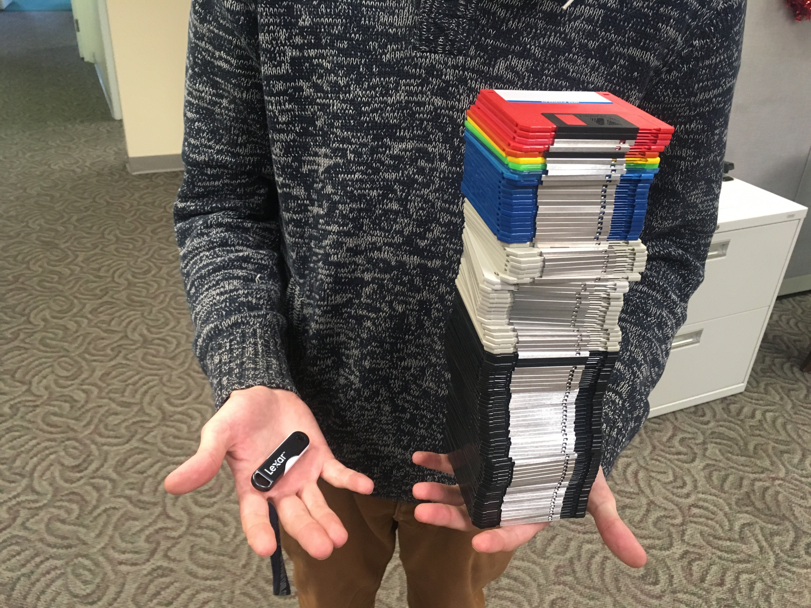
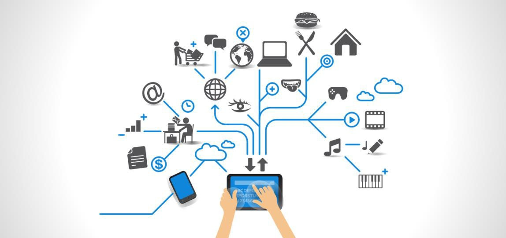

  | [**Sources**](/Sources) |

  
  The IoT and the Smart Home: Written by Payton Marlin

## **Why Talk about Smart-Home and the Internet of Things (IoT)?**
---
We have come a long way since the development of the first computational machine created by Alan Turing during WWII. Computers taking up a whole room just to do some simple calculations seems distant now, but that was 80 years ago. 

Now, people carry computers the size of a floppy disk in their pockets. These computers have almosst an infinite amount of storage when comparing it to the ancient floppy disk. These devices can access the internet, dounload files, and connect wirelessly to other devices seemlessly. The communication between these devices can be refered to as **The Internet of Things** or **IoT** for short. An area that I am particularly interested about is the Smart Home, where almost everything that has an electric signal can be controlled wirelessly.

The target audience is anyone who has knowledge about technology and a passion to learn about technology. As someone who invested their time into video-games and technology at a young age, I have always had a passion about the newest technological advancements.  

---

### **An Overview**

Throughout your reading on the Internet of Things and the Smart Home, I hope that you find new and valuable infromation regarding how these devices communicate and why you should invest in the smart homes of tomorrow.

This page of the website will give a synopsis of what both the Internet of Things is and how they can affect your home. If you want to go more in depth about a certain object, you can go to another page which will have more pictures/diagrams for you to read and learn about.

In addition to the two supportive pages, I will also have a bibliography page in case you want to read further along a particular subject. So, there will be four difference pages that you can refer to:
- The Home page (this page)
- The Internet of Things
- The Smart Home
- Sources

---
### **The Internet of Things**

Here in the present times, it is becoming more rare to go somewhere that does not have some sort of technology inside. Most restaraunts have televisions and a buzzer to alert the customer when their table is ready. Startup tech companies may have lightbulbs that can be dimmed and turned off with motion or a voice. Grocery stores have robots that checkup on the stock of a certain item. 

There is no doubt that we are in a technological era of evolution. As more and more devices become available, there will be more communication between them. According to [Networkworld.com](https://www.networkworld.com/article/3542891/the-internet-of-things-in-2020-more-vital-than-ever.html)

> ...A crazy variety of some 21 billion connected “things” are at this moment collecting data and performing all sorts of tasks. 

These "things" are simply technology. Technolgy devices that are constantly communicating with each other. Just like the example with the robot in grocery stores, it sends information regarding the stock of the current inventory. These "things" can do anything such as...

 - Managing security (locks, cameras, fences)
 - Start your car
 - Manage the washer and dryer
 - Open and close windows/doors
 - Operate the intensity of lights
 - Automatically do certain tasks after you wake up
 - Unlock and start your car before you get in it 
 - Many, many more...

 As you can see, this is just the tip of the iceberg of what advances and possibilities there are when connecting your devices to the internet and, more importantly, *to each other*. 

 Most of these devices will share a common internet router in the home/office, or can be connected to a central computer. If you want to read more information regarding the benefits and drawbacks of a infrastructure of Internet of Things, go **here**.

 For now, just know that the IoT will create a bond between man and machine. It will make our lives easier, and make monitoring certain events easier with the communication between devices. 

 ---
 ### **Smart Homes**

 After reading the brief overview of the IoT, you might wonder why you may want to read about smart homes.

 >Aren't they the same thing?

 Technically, yes. The IoT is needed in order to make a home 'smart'. The Internet of Things goes hand-in-hand with smart home technology. Without the Internet of Things, a smart home will just be a 'boring' old home. 

 One of the reasons why I want to talk about smart home is the applicability of both the IoT and the reality of today. You may often see movies of a secret spy or superhero that can control their house with their voice.

 > Jarvis, close the balcony windows. 

...
> Yessir, Mr. Stark

Movies that have this kind of technology may seem like a fantasy, when in fact the technology is already here. In simple terms, a smart home **uses the IoT to communicate with other devices in the house, creating a 'brain' of a living being that can control its body**. Much like Tony Starks 'Jarvis' assistant, we too have many [virtual assistants](https://en.wikipedia.org/wiki/Virtual_assistant) available to us. 

| Virtual Assistant  | Developer | IoT Compatable?  |  
|:---|:---:|---:|
| Alexa  | Amazon  | Yes  | 
| Bixby  | Samsung  | No  |  
| Cortona  | Microsoft  | Yes  |
| Google Assistant | Google | Yes |
| Siri | Apple | No |

This is just some of the many different virtual assistants offered by some of the largest tech companies. Some of them can be integrated into a smart home, signaled by a 'Yes' under 'IoT Compatable'. Some of them, however, can not be that are signaled by a 'no'. If you want to learn more about how to transition your home into a smart home, go **here**.

    
