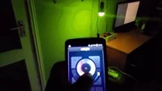
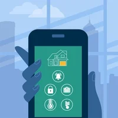

 | [**Smart Home**](/Smart.md) | [**Internet of Things**](/IoT.md) | [**Sources**](/Sources.md) |

## The Smart Home

You may have already have spoken to your phone via Siri®, Google®, Bixby®, or many other assitants and have allowed them to do something such as add an event in the calendar. This page will be short, but will show you some of the ways you can use your assistant to do many more things outside your phone. Of course, this will utilize the Internet of Things that you have already read. 

This JBL speaker can be turned on, off as well as the volume controls too. This allows the owner to control and device throughout the house with the sound of their voice. 

All you need to do is connect your device via the JBL app, with your prefered assistant (i.e Google Home app). Remember, **not all assistants are compatable.** 

### App ---> App
This is the basic concept of how *MOST* smart things will use. You will need to connect the variety of apps together to make the devices communicate. 

---

If you would like to make your home more modern by adding smart lighting, you can buy smart lighting bulbs from any retailer (Amazon, Walmart, Target). Like before, you will be able to control the lights from an app on your phone. Additionally, you will have the ability to connect select bulbs to your assistant's app if you would like to control with your voice. 

---

Along with smart speakers and smart lightning, there is also the ability to make your security smart. Apps like ADT Pulse allows the user to control the cameras, alarms, and the ability to monitor their house. There are also smart options to control your thermostat, garage, locks, and many more exterior paths. 

Although you may have to research and find someone to install a smart kit with your garage engine, it will pay off. Now, cars such as the Tesla Model 3 has a 'Smartlink' option to open your garage when you come into a certain distance of your home. 

---

There are a plethora of options to be able to configure your home into the 'smart home'. I hope that this page gave you a good read about how the smart home is controlled by the IoT and, most importantly, by apps.

> ## The future of technology is apps

Keep this in mind as you progress through the era of technology. I hope that this website has helped you understand the IoT and the Smart-Home.

 | [**Smart Home**](/Smart.md) | [**Internet of Things**](/IoT.md) | [**Sources**](/Sources.md) |
